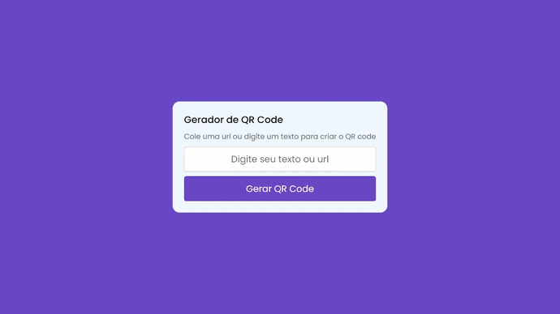

<h1 align="center"> QR Code personalizado </h1>
<h3 align="center"> Cria Qr Code a partir de texto e url </h3>

  <a href=".techs">Tecnologias</a>
  &nbsp;&nbsp;&nbsp;|&nbsp;&nbsp;&nbsp;
  <a href=".techs">Features</a>

 

  
  (Clique na imagem para acessar o site)

 

  
## 🚀 Tecnologias

Esse projeto foi desenvolvido com as seguintes tecnologias:

- HTML e CSS
- JavaScript
- Git e Github
- Consumo da API: https://quickchart.io/

## 💻 Features 

Esse projeto tem as seguintes features:

- Gerar um QR Code personalizado com base no input do usuário
- Consumo da API que gera a imagem
- Responsividade

  

    Feito com ♥ by <a href="https://github.com/ryan-melo" target="_blank">Ryan Melo</a> &nbsp;&nbsp;&nbsp;|&nbsp;&nbsp;&nbsp; 
    :wave: Me acompanhe no <a href="https://www.linkedin.com/in/ryan-melo-m/" target="_blank">LinkedIn</a>!
  

